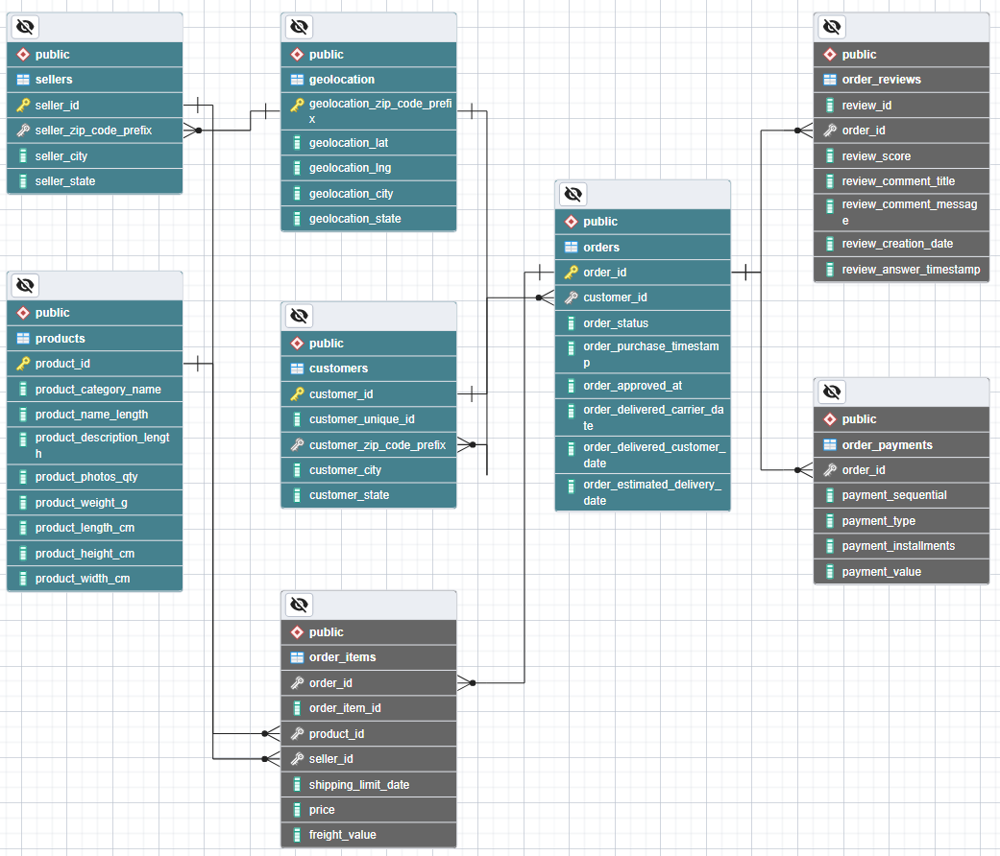
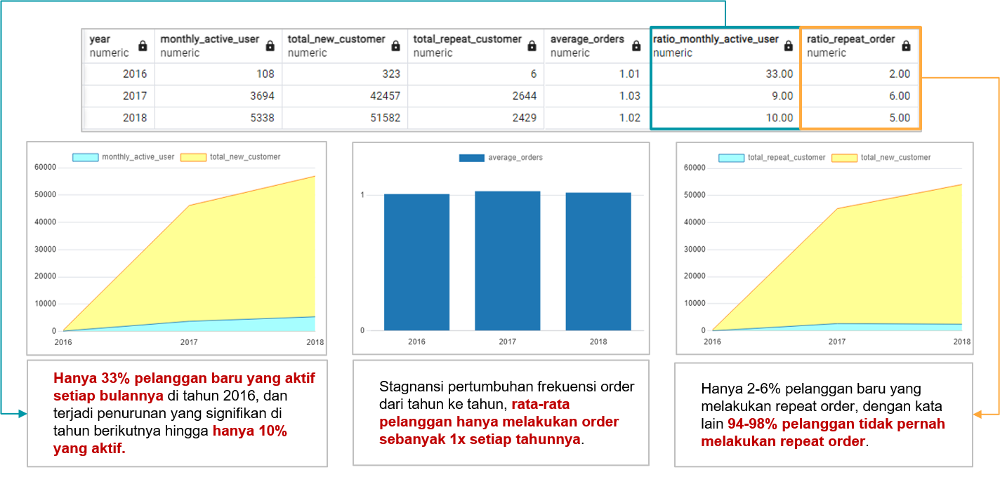
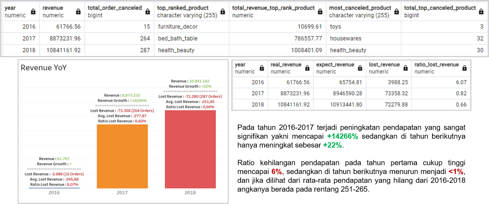
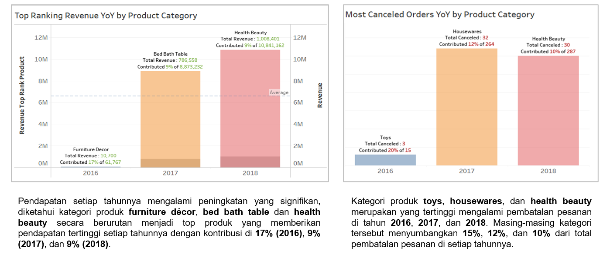
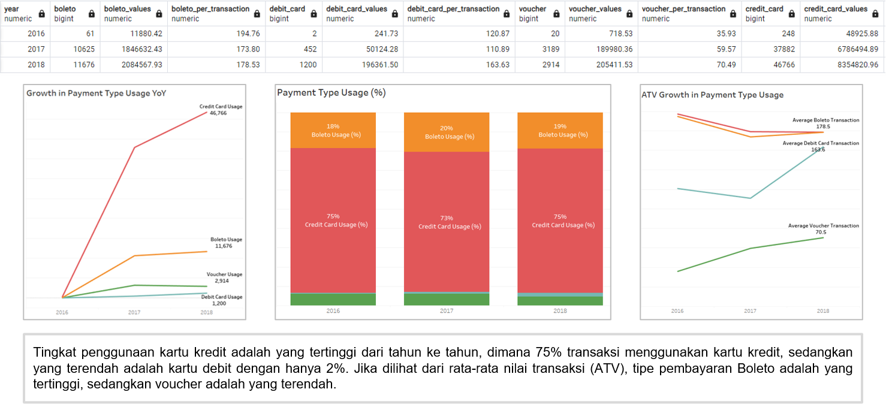
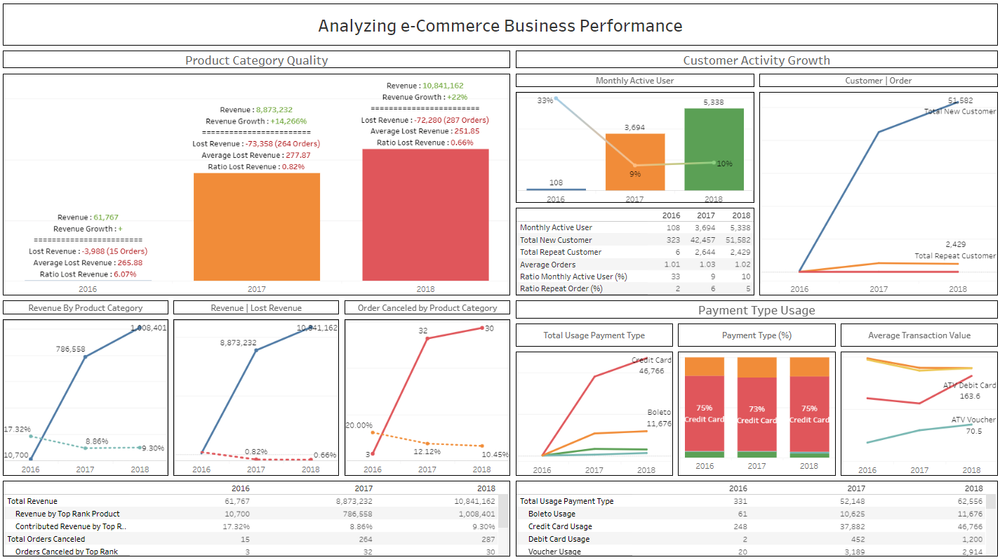

# eCommerce-Business-Performace

## Business Understanding

Dalam suatu perusahaan mengukur performa bisnis sangatlah penting untuk melacak, memantau, dan menilai keberhasilan atau kegagalan dari berbagai proses bisnis. Oleh karena itu, dalam paper ini akan menganalisa performa bisnis untuk sebuah perusahan eCommerce, dengan memperhitungkan beberapa metrik bisnis yaitu pertumbuhan pelanggan, kualitas produk, dan tipe pembayaran.

---

## Data Preparation

1. Membuat database baru bernama ecommerce ([referensi](https://www.postgresqltutorial.com/postgresql-administration/postgresql-create-database/)).
2. Inspeksi file .csv untuk setiap masing-masing tabel pada database ([dataset](Dataset)).

   - customers_dataset.csv (99441 records)
   - product_dataset.csv (32951 records)
   - orders_dataset.csv (99441 records)
   - sellers_dataset.csv (3095 records)
   - geolocation.csv (1000163 records)
   - order_payments_dataset.csv (100386 records)
   - order_items_dataset.csv (112650 records)
   - order_reviews_dataset.csv (99224 records)
3. Membuat tabel menggunakan query ([query](Query/CREATE%20TABLE.sql)).
4. Mengimport file .csv ke setiap masing-masing tabel ([referensi](https://www.postgresqltutorial.com/postgresql-tutorial/import-csv-file-into-posgresql-table/)).
5. Pada tabel geolocation terdapat duplicate pada kolom zip code, sehingga tidak dapat dihubungkan ke tabel
   customers dan sellers sebelum menghapusnya duplicate ([query](Query/DUPLICATED%20GEOLOCATION%20ZIP%20CODE.sql)).
6. Membuat ERD dengan cara klik kanan pada database ([referensi](https://www.pgadmin.org/docs/pgadmin4/latest/erd_tool.html)).
7. Generate SQL query dari ERD, dan menjalankan query tersebut ([query](Query/SQL%20GENERATED%20ERD.sql)).

---

## Annual Customer Activity Growth Analysis

**Summary:**
Berdasarkan 4 metrics yang mengukur pertumbuhan pelanggan, hanya 3 metrics yang menunjukkan adanya peningkatan. Sedangkan pertumbuhan rata-rata order cenderung stagnan sejak 2016, bahkan jumlah rata-rata order tidak lebih dari 1. Lebih lanjut diketahui dari rasio pengguna aktif dan rasio repeat order, diketahui jumlahnya masih sangat rendah dan terjadi penurunan yang signifikan di tahun berikutnya.

Hal ini menunjukkan meskipun dapat menarik pelanggan baru, namun mereka mungkin tidak terlalu aktif dalam menggunakan layanan atau produk secara teratur setiap bulan. Ini dapat menjadi sinyal untuk memeriksa kembali strategi retensi pelanggan dan mungkin mencari cara untuk meningkatkan keterlibatan pelanggan setelah mendaftar.
Analisis lebih lanjut mungkin diperlukan untuk memahami penyebab rasio yang rendah dan menentukan tindakan yang tepat untuk meningkatkan keterlibatan pelanggan dan memperbaiki rasio tersebut.

---

## Annual Product Category Quality Analysis

**Revenue Growth YoY**

**Top Rank Product Category Based on Revenue and Most Canceled Product Category**

**Summary:**
Pendapatan perusahaan mengalami pertumbuhan yang signifikan pada tahun 2016-2017, diikuti oleh peningkatan yang lebih lambat pada tahun berikutnya. Ratio kehilangan pendapatan menunjukkan penurunan dari tahun pertama ke tahun kedua. Kategori produk seperti furniture décor, bed bath table, dan health beauty secara konsisten memberikan pendapatan tertinggi, sementara kategori toys, housewares, dan health beauty memiliki tingkat pembatalan pesanan yang tinggi.

Berdasarkan hal tersebut direkomendasikan untuk meningkatkan upaya pemasaran dan penjualan untuk produk-produk pada kategori unggulan dengan tetap fokus untuk mengurangi kehilangan pendapatan. Perlu analisa lebih lanjut terkait faktor-faktor yang mempengaruhi pembatalan pesanan, seperti kualitas produk, kualitas pengiriman, dan kualitas pembayaran.

---

## Annual Payment Type Usage Analysis

**Summary:**
Direkomendasikan untuk memberikan feedback kepada Bank dan penyedia layanan pembayaran untuk terus mengembangkan solusi inovatif untuk memenuhi kebutuhan dan preferensi pelanggan. Ini bisa termasuk peningkatan keamanan transaksi, penyederhanaan proses pembayaran, atau penambahan fitur-fitur tambahan yang dapat menarik minat pengguna. Perlu dilakukan upaya untuk meningkatkan penggunaan kartu debit. Ini bisa melibatkan kampanye edukasi untuk meningkatkan kesadaran masyarakat tentang manfaat menggunakan kartu debit, seperti keamanan dan kenyamanan dalam mengontrol keuangan.

---

## Reports

[View in Tableau Public](https://public.tableau.com/views/Analyzinge-CommerceBusiness/Analyzinge-CommerceBusinessPerformance?:language=en-US&:sid=&:display_count=n&:origin=viz_share_link)

